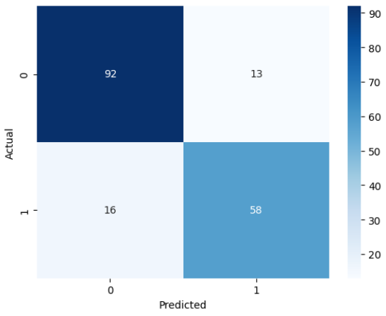
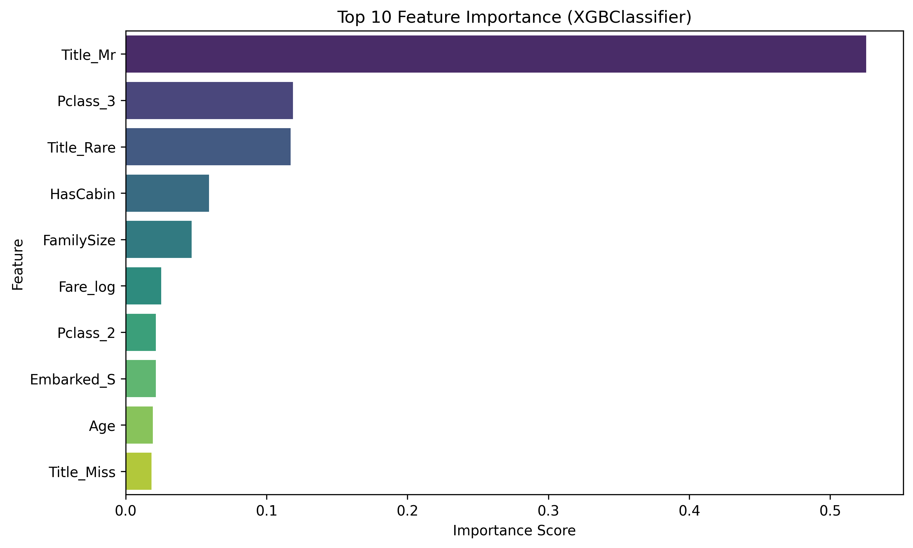

# Titanic Survival Prediction

**End-to-End Data Science Practice Project**
A machine learning project to predict passenger survival on the Titanic, focusing on a complete data science workflow: **problem framing, EDA-driven decisions, feature engineering, model comparison, and interpretation**.

---

## Project Overview

This project applies data science and machine learning techniques to the classic Titanic dataset. The emphasis is on **understanding the data before modeling**, making statistically motivated preprocessing decisions, and comparing different model families to evaluate both **performance and generalization**.

The task is framed as a **binary classification problem**, where the goal is to predict whether a passenger survived (`1`) or did not survive (`0`).

---

## Dataset

The dataset is based on the Kaggle Titanic dataset and contains information about passengers, including:

* **Demographics:** Age, Sex
* **Socioeconomic status:** Passenger Class (Pclass), Fare
* **Family relationships:** SibSp, Parch
* **Port of embarkation:** Embarked
* **Target variable:** Survived

---

## Project Structure

```text
TITANIC-SURVIVAL-ML/
├── data/                  # Raw and processed CSV files
│   ├── titanic.csv
│   ├── titanic_train.csv
│   ├── titanic_test.csv
│   ├── cleaned_titanic_train.csv
│   └── featured_titanic_train.csv
├── images/                # Visualizations (Confusion Matrix, Feature Importance)
├── models/                # Serialized models (.pkl)
│   ├── logistic_regression.pkl
│   ├── random_forest.pkl
│   └── xgboost_model.pkl
├── notebooks/             # Step-by-step Jupyter Notebooks
│   ├── 01_EDA.ipynb
│   ├── 02_DataCleaning.ipynb
│   ├── 03_FeatureEngineering.ipynb
│   ├── 04_ModelTraining.ipynb
│   └── 05_Evaluation.ipynb
├── README.md
└── requirements.txt       # List of dependencies
```

---

## Methodology & Workflow

### 1. Exploratory Data Analysis (EDA)

EDA was used to guide all preprocessing and modeling decisions.

* Analyzed feature distributions and identified that **Fare** is highly **right-skewed**.
* Explored relationships between categorical variables (e.g., **Title vs. Sex**) to detect redundancy and potential multicollinearity.
* Examined survival rates across passenger classes, titles, and gender to extract domain-relevant insights.

---

### 2. Data Preprocessing

**Handling Missing Values**

* **Age:** Imputed using the **median age grouped by Title** (Mr., Miss, Mrs., etc.) to respect demographic differences and reduce bias from skewness.
* **Embarked:** Imputed using the mode.
* **Fare:** Imputed using the median.

**Title Extraction**

* Extracted passenger titles from names.
* Rare titles (e.g., Don, Capt, Col) were grouped into a single category to reduce noise and improve model robustness.

---

### 3. Feature Engineering

* **Log Transformation:** Applied `np.log1p(Fare)` to reduce right-skewness and improve numerical stability.
* **Multicollinearity Handling:** Due to strong correlation between **Sex** and **Title**, redundant features were removed to improve interpretability and model stability.
* **Scaling:** Applied `StandardScaler` to numerical features for distance-based models (e.g., Logistic Regression).

---

### 4. Model Training & Evaluation

Three models from different families were trained and evaluated:

1. **Logistic Regression** – Linear baseline model
2. **Random Forest** – Bagging-based ensemble
3. **XGBoost** – Gradient boosting model

Evaluation was performed using **5-Fold Cross-Validation** to assess generalization.

**Primary Metric:** Accuracy
Accuracy was chosen due to the relatively balanced class distribution. Confusion matrices were also analyzed to ensure balanced error rates between survivors and non-survivors.

---

## Results

| Model               | CV Mean Accuracy | Test Accuracy | Observations                          |
| ------------------- | ---------------- | ------------- | ------------------------------------- |
| **XGBoost**         | 0.8076           | **0.8380**    | **Best overall performance**          |
| Logistic Regression | **0.8272**       | 0.8268        | **Most stable** (minimal CV–test gap) |
| Random Forest       | 0.8006           | 0.8212        | Good generalization but outperformed  |

**Stability** refers to the gap between cross-validation accuracy and test accuracy, indicating how well the model generalizes to unseen data.

---

## Confusion Matrix (Best Model: XGBoost)

The confusion matrix shows that the model:

* Correctly classifies a large portion of non-survivors (True Negatives)
* Maintains a balanced trade-off between false positives and false negatives



---

## Key Insights

Feature importance analysis from the XGBoost model reveals:

1. **Title_Mr is the strongest predictor**
   Adult males had the lowest survival probability, aligning with the historical *“Women and children first”* policy.

2. **Passenger class matters**
   `Pclass_3` strongly correlates with lower survival, highlighting the impact of socioeconomic status.

3. **Social status beyond ticket price**
   Rare titles (e.g., Capt, Col, Don) also influenced survival, suggesting rank and authority played a role.



---

## Tech Stack

* **Language:** Python
* **Libraries:** Pandas, NumPy, Scikit-learn, XGBoost, Matplotlib, Seaborn, SciPy, Joblib
* **Environment:** Jupyter Notebook

---

## How to Run

1. Clone the repository:

```bash
git clone https://github.com/ceeguypun/titanic-survival-ml.git
```

2. Navigate to the project directory:

```bash
cd TITANIC-SURVIVAL-ML
```

3. Install dependencies:

```bash
pip install -r requirements.txt
```

4. Run the notebooks in order, starting from `01_EDA.ipynb`.

---

## Limitations & Future Work

* Hyperparameter tuning was limited to basic configurations.
* Future improvements may include:

  * GridSearchCV or Bayesian optimization
  * SHAP values for improved interpretability
  * Additional feature interaction analysis

---

## Conclusion

This project demonstrates a structured, EDA-driven approach to machine learning, emphasizing **interpretability, generalization, and domain understanding** rather than raw performance alone.
